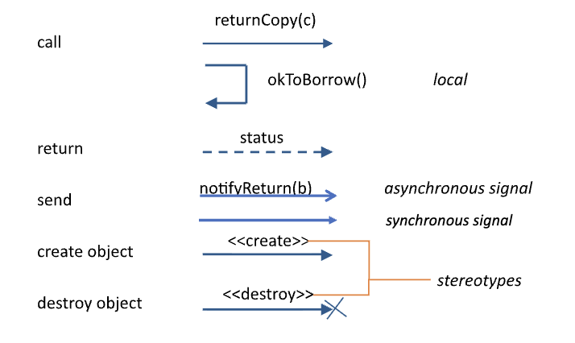
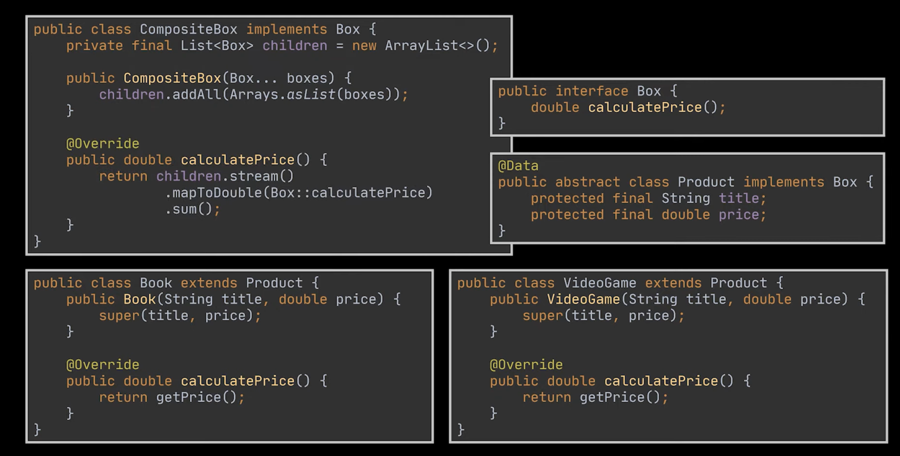
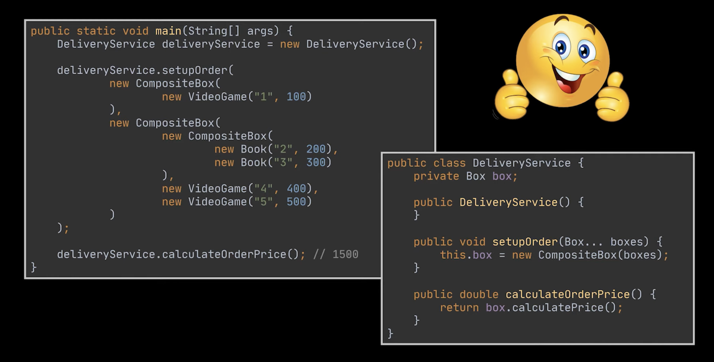
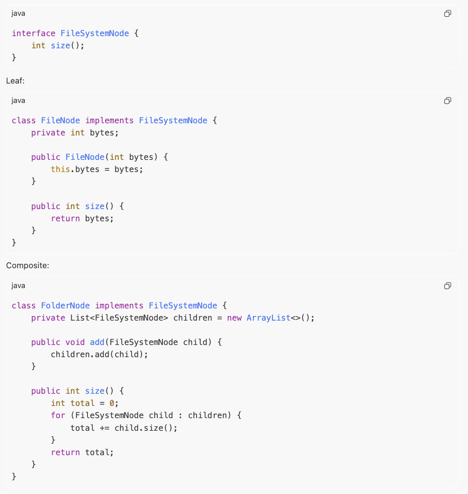
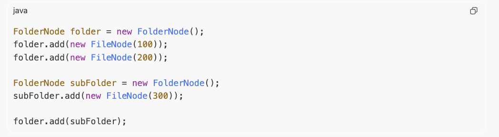

# CS5150 Software Engineering

Cornell Univeristy Spring 2026, course notes.

## Lec 2
Identify stakeholders: developer, client, customer, user  
Process Models:
- Waterfall
    - rigid, fixed structure, no going back
    - use when req are stable and complete
- Modified Waterfall
    - waterfall with feedback loop
    - use when req are mostly stable but not perfectly
- Prototyping / Iterative Refinement
    - design, prototype, customer eval, review - repeat
    - use when users do'nt know what they want
- Incremental Delivery
    - use when partial functionality is useful
    - need continuous progress
- Agile
    - use when req change often
    - customer feedback is freq
- Extreme Programming (Agile method)
    - code quaity matters
    - small releases, pair programming
    - Scrum (management strcuture for agile)
        - scrum gives sprint structure
- COTS
    - Commercial Off The Shelf
    - use when problem is common
    - when existing tools are good enough
- Mixed Processes
- Phased Development

## Lec 3
Requirements  
Subphases:
- Analysis
- Modeling
- Specifications  
Types:
- Functional
    - what the system must do
    - features, behaviors, services
- Non-Functional
    - how well the system must do it
    - what constraints it must obey
    - performance, security, reliability, usability, legal, maintainability, scalability  
Validation & Verification
- Are you building the right thing?
- Did you build it right?

## Lec 4
Modeling  
Types:
- External, Structural, Interaction, Behavioral  
UML
- Use Case
    - actor
    - use case (action)
    - Relationships:
        - \<<includes\>> base case ---->
            - included use case executes always when the base use case is executed
        - \<<extends\>>  base case <----
            - extended use case executes only sometimes when the base case is executed
- Sequence
    - actor
    - objects
    - lifelines
    - messages
        - request message _______> or <_______
        - return message <----
    - alternative frame
- Data Flow
    - Activity (rounded rect)
    - Data (rect)
    - start / end (circle)
- Class
- State / Transition tables

## Lec 5
Feasibility  
Estimation for Scheduling
- Parkinson's Law  
Activity Networks
- Critical Path Analysis
    - Earliest completion dates
        - forward pass
        - max
        
    - Slack
        - backward pass
        - min
        
    - Critical Path:
        path with no slack

## Lec 6
Architecture  
Levels of Abstraction
- Req: High level `what`
- Architecture: Mid level `what`, High level `how`
- System Design: Low level `what`, Mid level `how`
- Code: Low level `how`

Coupling & Cohesion
- Coupling: dependencies between subsystems, high - changing one subsystem tends to affect others
- Cohesion: the functions inside the subsystem are highy related, high - the subsystem has a focused purpose
- Good Architecture: Low Coupling, High Cohesion (Simplicity)

## Lec 7
Design vs Architecture  
Architecture parts:
- Package - conceptual grouping
- Component - software unit with interfaces
- Node - physical place where software runs (nodes consist of components)  

Architecture Diagram Types:
- Conceptual diagram - how are the main parts connected? (packages)
- Interface / Component diagram - how are major parts connected (components)
- Deployment diagram - what runs where physically? (nodes)  

Architectural Styles:
- Client-Server
    - use:
        - you have request/response interaction across machines
        - separation between consumer and provider is natural
- Layered
    - stack of layers
    - each layer uses the one below and serves the one above
    - use:
        - the system benefits from clean abstraction boundaries
        - you want controlled dependencies
    - eg: OS
- Pipe and Filter
    - data flows flows through a sequence of transformations
    - each stage process input and produce output
    - like an assembly line for data
    - use:
        - the main job is transforming data step by step
    - eg: compiler, signal processing
- Repository
    - shared central data
    - low coupling
    - good for backup
    - single point of failure risk
    - everyone works through one shared source of truth
    - use:
        - the main system coordination happens around shared data

## Lec 8
Architectural Styles contd.:
- MVC
- Publish-Subscribe
    - event driven
    - publishers emit event, subscriber react
    - loose coupling
- Virtualization
    - multiple OS, one machine managed by host OS
    - low cost, high overhead
    - eg: VMware, VirtualBox, Xen
- Containers
    - lighter than VMs
    - Packing one application/service
    - contains everything an application needs to run
    - eg: docker, LXC
- Serverless
    - split the system into event-triggered functions run by a cloud platform.
    - less infra management
    - small functions that run only when triggered
- Microservices
    - many small services, each running as its own mini-application
    - coordination btw each services is difficult
    - provided through REST/HTTP
    - scalable, fault tolerant
    - reduce coupling, increase operations complexity
    - eg: netflix, amazon, uber

## Lec 8 (System Design)
UML Design Choices:
- Requirements: Use case diagram
- Architecture: Component, Deployment design
- System Design: Class diagram(structural, classes, interface, etc) and Sequence diagram (objects and relationships)

Class diagram:  
Relationships:

| Type | Relationship |
|---|---|
| Association | *class1* --------- *class2* |
| Dependency | *dependent* - - - - - - > *dependency* |
| Generalization (inheritance) | *child* -----------\|> *parent* |
| Realization (interfaces) | *class* - - - - -\|> *interface* |
| Aggregation | *whole* o------ *part* |

## Lec 9
System Design contd.  
Sequence Diagram  
Messages:

- focus on Asynchronous > (caller doesn't wait) and synchronous messages |> (caller waits)

#### Design Patterns
- Observer:
    - one object changes state
    - many other objects need to react
- Builder (creation pattern)
    - an object is complicated to construct
    - constructors become messy
    - you want readable step-by-step configuration
    - maybe the final object should be immutable
- Factory (creation pattern)
    - you want an object of some interface
    - but you do not want client code to know the exact subclass
- RAII
- Singleton - (Anti)pattern:
    - Single global instance of class
    - you can only call that INSTANCE
    - anti pattern cause shouldn't be used unless very essential
- Composite:
    - uniformity is key
    - you have a tree structure
    - leaf nodes and parent nodes should be treated uniformly
    - when you want to a treat single thing and group of things the same way
    - makes it easier to calculate total values of all the objects
    - boxes with boxes example, to get price
    
    
    - file, folder example, to get size
    - the class attribute inside composite class (FolderNode) children are of type FileSystemNode which can be Files or Folders
    - the size() func inside FolderNode handles the size wrt to this type
    
    
    - output: 600
- Visitor:
    - you already have many classes
    - you want to add new operations without modifying those classes repeatedly
    - https://www.youtube.com/watch?v=UQP5XqMqtqQ

## Lec 10
Design Patterns contd.:
- Facade:
    - masks heavy underlying code
    - provides simple interface for client
    - the system has many low-level classes
    - you want to expose a simpler high-level interface
    - let's say you want to take an amount, then check if the user has enough balance, then deduct that amount from the bank balance, then send and email as well. Now the deduct func is part of a third party lib, you will call that and do al of the other stuff like checking balance and sending email before and after calling this func. Now let's say you want to use this in multiple places of your code. The system will get really messy if you need to change something later, the system becomes highly coupled - That's BAD. So we do FACADE, we create a FACADE interface with a function to do this whole thing and just call it once whereever we wanna use that.

## Lec 11
Version Control  

Centralised Version Control (OLD WAY)
- one central repo
- each user has working copy
- user commits changes to repo
- user sees the changes after update  

Distributed Version Control (NEW WAY)
- each user has a local copy of the repo, each storing it's own version history
- each user works in the working copy of their respective repo
- commits made are only made in the local repo, until pushed
- changes made to the remote repo is not visible in local repo unless fetched
- changes fetched is not visible in the working copy unless update  

Basic Git Workflow:
- `git pull`
- create or switch to a branch
- edit files
- run tests
- `git add`
- `git commit`
- `git pull` again if needed
- run tests again
- `git push`  

Key Commands:
- `git add` = put changes into staging
- `git commit` = save a snapshot in local repo
- `git push` = send local commits to remote
- `git fetch` = download remote history
- `git merge` = combine histories
- `git pull` = `fetch + merge`  

Branches: main/trunk branch, development branch, release branch  

Merge vs Rebase vs Squash
```text
History:
main:    A --- B
               \
feature:        C --- D

Merge:
A --- B -------- M
       \        /
        C ---- D

Rebase:
A --- B --- C' --- D'

Squash:
A --- B --- S
```

Conflicts:  
- obvious failure
- silent failure  

## lec 12

Clone vs Branch vs Fork:
- `clone` = copy repo to your machine
- `branch` = create a work lane inside the repo
- `fork` = create your own remote copy of someone else’s repo  

Git terms:
- `branch`: movable pointer to a line of development
- `remote`: another copy of the repo, often GitHub
- `fetch`: download remote history without merging
- `merge`: combine histories
- `rebase`: replay commits on top of another base
- `checkout`: switch branch or restore files
- `restore`: undo working tree changes
- `diff`: show changes
- `log`: show history
- `SHA`: commit/object identifier
- `HEAD`: what commit/branch you are currently on
- `staging`: area between working directory and commit
- `blame`: who last changed each line
- `bisect`: binary search through history to find a bug-introducing commit
- `cherry-pick`: copy one specific commit onto another branch
- `tag`: label a specific commit, often for releases
- `amend`: modify the most recent commit
- `revert`: undo a commit by making a new opposite commit
- `reset`: move branch/HEAD backward; can be destructive if misused
- `submodule`: repository nested inside another repository