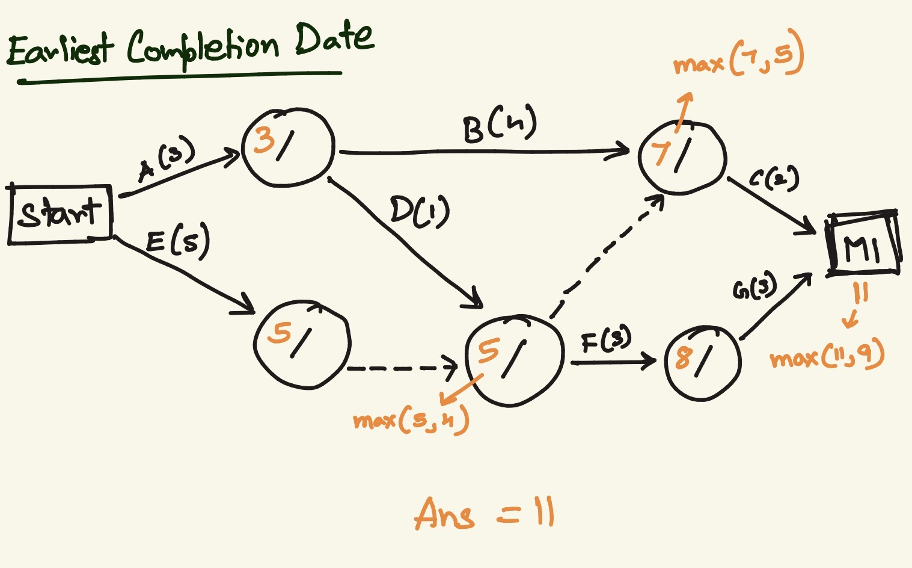
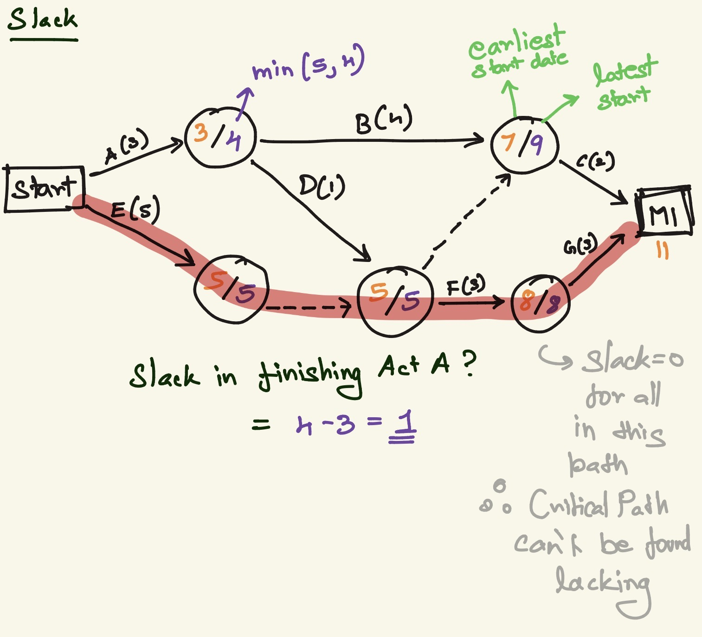

# Exam Prep

### Lec 2
Identify stakeholders: developer, client, customer, user  
Process Models:
- Waterfall
    - rigid, fixed structure, no going back
    - use when req are stable and complete
- Modified Waterfall
    - waterfall with feedback loop
    - use when req are mostly stable but not perfectly
- Prototyping / Iterative Refinement
    - design, prototype, customer eval, review - repeat
    - use when users do'nt know what they want
- Incremental Delivery
    - use when partial functionality is useful
    - need continuous progress
- Agile
    - use when req change often
    - customer feedback is freq
- Extreme Programming (Agile method)
    - code quaity matters
    - small releases, pair programming
    - Scrum (management strcuture for agile)
        - scrum gives sprint structure
- COTS
    - Commercial Off The Shelf
    - use when problem is common
    - when existing tools are good enough
- Mixed Processes
- Phased Development

### Lec 3
Requirements  
Subphases:
- Analysis
- Modeling
- Specifications  
Types:
- Functional
    - what the system must do
    - features, behaviors, services
- Non-Functional
    - how well the system must do it
    - what constraints it must obey
    - performance, security, reliability, usability, legal, maintainability, scalability  
Validation & Verification
- Are you building the right thing?
- Did you build it right?

### Lec 4
Modeling  
Types:
- External, Structural, Interaction, Behavioral  
UML
- Use Case
    - actor
    - use case (action)
    - Relationships:
        - \<<includes\>> base case ---->
            - included use case executes always when the base use case is executed
        - \<<extends\>>  base case <----
            - extended use case executes only sometimes when the base case is executed
- Sequence
    - actor
    - objects
    - lifelines
    - messages
        - request message _______> or <_______
        - return message <----
    - alternative frame
- Data Flow
    - Activity (rounded rect)
    - Data (rect)
    - start / end (circle)
- Class
- State / Transition tables

### Lec 5
Feasibility  
Estimation for Scheduling
- Parkinson's Law  
Activity Networks
- Critical Path Analysis
    - Earliest completion dates
        - forward pass
        - max
        
    - Slack
        - backward pass
        - min
        
    - Critical Path:
        path with no slack

### Lec 6
Architecture  
Levels of Abstraction
- Req: High level `what`
- Architecture: Mid level `what`, High level `how`
- System Design: Low level `what`, Mid level `how`
- Code: Low level `how`  
Coupling & Cohesion
- Coupling: dependencies between subsystems, high - changing one subsystem tends to affect others
- Cohesion: the functions inside the subsystem are highy related, high - the subsystem has a focused purpose
- Good Architecture: Low Coupling, High Cohesion (Simplicity)

### Lec 7
Design vs Architecture  
Architecture parts:
- Package - conceptual grouping
- Component - software unit with interfaces
- Node - physical place where software runs (nodes consist of components)  
Architecture Diagram Types:
- Conceptual diagram - how are the main parts connected? (packages)
- Interface / Component diagram - how are major parts connected (components)
- Deployment diagram - what runs where physically? (nodes)  
Architectural Styles
- Client-Server
    - use:
        - you have request/response interaction across machines
        - separation between consumer and provider is natural
- Layered
    - stack of layers
    - each layer uses the one below and serves the one above
    - use:
        - the system benefits from clean abstraction boundaries
        - you want controlled dependencies
    - eg: OS
- Pipe and Filter
    - data flows flows through a sequence of transformations
    - each stage process input and produce output
    - like an assembly line for data
    - use:
        - the main job is transforming data step by step
    - eg: compiler, signal processing
- Repository
    - shared central data
    - low coupling
    - good for backup
    - single point of failure risk
    - everyone works through one shared source of truth
    - use:
        - the main system coordination happens around shared data

### Lec 8
Architectural Styles contd.:
- MVC
- Publish-Subscribe
    - event driven
    - publishers emit event, subscriber react
    - loose coupling
- Virtualization
    - multiple OS, one machine managed by host OS
    - low cost, high overhead
    - eg: VMware, VirtualBox, Xen
- Containers
    - lighter than VMs
    - Packing one application/service
    - contains everything an application needs to run
    - eg: docker, LXC
- Serverless
    - split the system into event-triggered functions run by a cloud platform.
    - less infra management
    - small functions that run only when triggered
- Microservices
    - many small services, each running as its own mini-application
    - coordination btw each services is difficult
    - provided through REST/HTTP
    - scalable, fault tolerant
    - reduce coupling, increase operations complexity
    - eg: netflix, amazon, uber
    